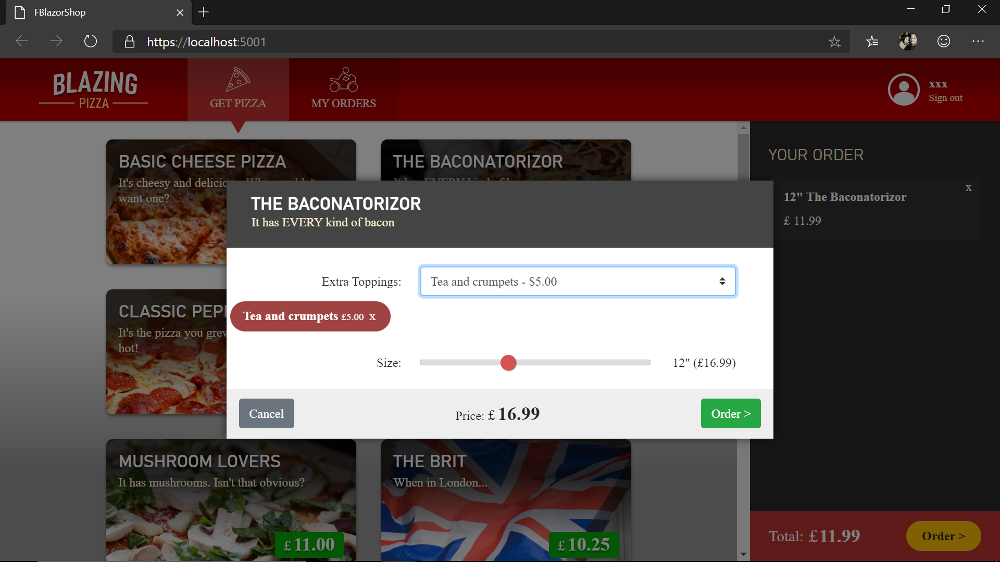

This is a port of Steve Sanderson's [Pizza Workshop](https://github.com/dotnet-presentations/blazor-workshop) for Blazor
by using F# and Bolero.
Live version working with WASM is here (https://fblazorshop.azurewebsites.net/)

- Requires .NET Core 3.1 SDK
- Just start the FBlazorShop.Web project

By default the application runs on Server-side mode. If you want Web Assembly, just add WASM compilation constant to the FBlazorShop.Web project and rebuild.
