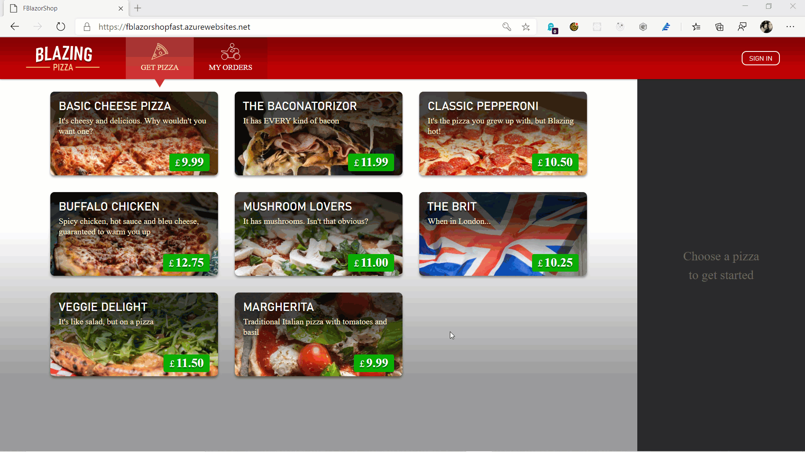

This is a port of Steve Sanderson's [Pizza Workshop](https://github.com/dotnet-presentations/blazor-workshop) for Blazor
by using F# and Bolero. It also shows an example on How to do CQRS with Event Sourcing using Akka Cluster Sharding. (See how orders are placed on server side)

## Build & Run instructions (Windows, Linux and macOS):
- Building requires .NET Core SDK 3.1.401 or newer 
- It won't work on .net 5 as of now but side by side .net core 3.1 and .net 5 is fine.
- For Linux and macOS you also need Mono 6.x while building.
- Clone the repository (if you choose to download zip, you may need to unblock .config/dotnet-tools.json on windows platform)
- Windows users can just run **run-server-64-bit.cmd** or **run-wasm-64-bit.cmd** depending on which version they want to run.
- Linux users should run **un-server-64-bit.sh** or **run-wasm-64-bit.sh**
- Then open your browser and browse **http://localhost:5000**.
- Visual studio or VS Code users should first execute one of the run commands above then they can just open the solution and start the FBlazorShop.Web project (better set it as StartUp project). By default the application runs on Server-side mode. If you want Web Assembly, just add WASM compilation constant to the FBlazorShop.Web project and rebuild.
